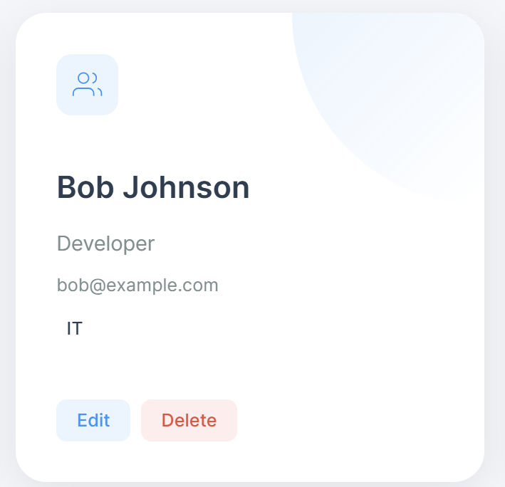
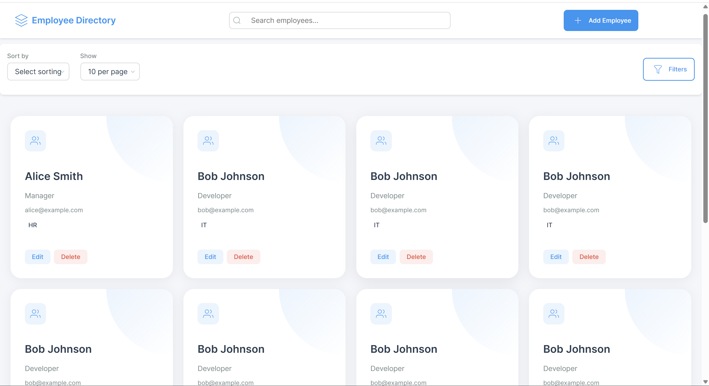

# 👥 Employee Directory (Spring Boot + Freemarker + JS)

A dynamic, interactive Employee Directory web application built with **Spring Boot**, **Freemarker templates**, and **modular JavaScript**. This project focuses on clean UI, DOM-based rendering, and frontend data handling with `localStorage`.

---

## 🚀 Setup & Run Instructions

### 🧩 Prerequisites
- Java 17+
- Maven 3.8+
- (Optional) Git

### 🛠️ Steps to Run Locally

```bash
# 1. Clone the repository
git clone https://github.com/your-username/employee-directory.git
cd employee-directory

# 2. Build the project
mvn clean install

# 3. Run the application
java -jar target/employee-directory-1.0-SNAPSHOT.jar

employee-directory/
├── src/
│   ├── main/
│   │   ├── java/com/example/
│   │   │   ├── controller/
│   │   │   │   └── HomeController.java
│   │   │   └── EmployeeDirectoryApplication.java
│   │   └── resources/
│   │       ├── static/
│   │       │   ├── css/ (animations, base, components, utilities)
│   │       │   └── js/
│   │       │       ├── modules/
│   │       │       │   ├── DataManager.js
│   │       │       │   ├── FilterManager.js
│   │       │       │   ├── SearchManager.js
│   │       │       │   └── UIController.js
│   │       │       └── app.js
│   │       └── templates/
│   │           ├── components/
│   │           │   ├── header.ftl, footer.ftl, modal.ftl, etc.
│   │           └── index.ftl
│   └── application.properties
├── pom.xml
└── README.md

### Screenshots



## Reflection

### Challenges Faced:
Exploring and implemeting the Freemaker for the first time
Not relying on backend
Debugging Freemaker syntax in components

### If Given More Time:
Add backend storage (e.g., MySQL/MongoDB).
Add image upload + avatar management for employees.
Implement full authentication (admin/user roles).

